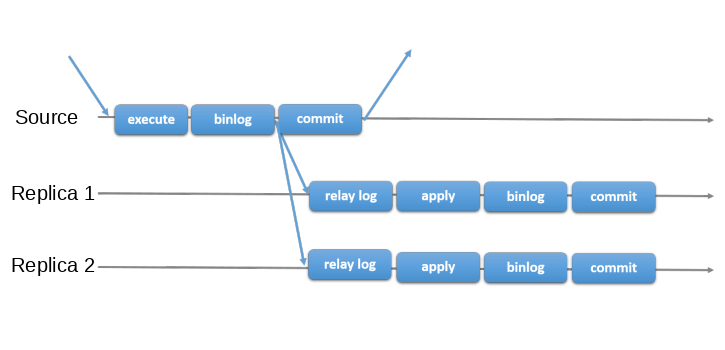
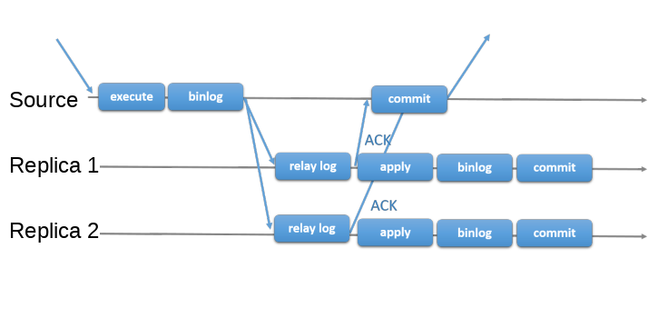
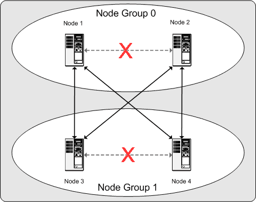

# mysql database replication 

MySQL has serval types of replication.

MySQL traditionally provides a primary secondary replication approach, both `Asynchronous Replication` and `Semi-Synchronous Replication` are examples of this.  

1. Asynchronous Replication.  
There is a source that is the primary and all other servers are secondary.  
The source executes transactions they are then committed and later sent to the others servers asynchronously.  
Other servers operate in one of two replication modes
   1. `Statement-based` where secondary servers re-execute the sent commands.
   2. `Row-based` where the rows are applied to the secondary databases.  


[Source](https://dev.mysql.com/doc/refman/8.0/en/group-replication-primary-secondary-replication.html)

2. Semi-Synchronous Replication.  
    Semi-Synchronous Replication operates the same as asynchronous replication with an added synchronization step.
    This means that the primary server will wait before committing until the secondary servers acknowledge that the transaction has been received. Only after the transaction has been received on all servers does the primary commit the transaction.


[Source](https://dev.mysql.com/doc/refman/8.0/en/group-replication-primary-secondary-replication.html)


3. Group Replication.  
    A replication group is a set of servers that all contain a full copy of the data, interaction between the servers is done with message passing. Message passing guarantees `atomic broadcast` meaning that either all servers receive the message or none do. If the message is received then all servers received it in the same order. This establishes a global total order for the transactions.
    Each server in the group can execute transactions independently, but read-write transactions are only committed when agreed upon by the group.  
    Read only transactions are immediate.  
    When the originating server is ready to commit a read-write transaction, it sends the rows that were changed to the other servers.

    Transaction Certification.   
    Transactions are `certified` by the group of servers to be free of conflicts. A conflict occurs when two concurrent transactions that executed on different servers operate on the same row. Conflicts are resolved by committing the transaction that occurred first and the second transaction is aborted and rolled back on the originating server and dropped by the other servers.

    Certified transactions do not need to be applied in the agreed order if this does not break `consistency` or `validity`. This means that group replication is an eventual consistency system while under load data may not be consistent between servers in the group.

    For Example
    In `Multi-Primary` mode a local transaction may be externalized immediately following `certification` even if there is a remote transaction that occurs before the local transaction in the global transaction order. This is permitted when certification has established no conflicts between the two transactions.

    In `Single-Primary` there is a small chance that on the primary server transactions may be committed in a different order than the global transaction order.

    Secondary read only servers apply transactions in the global order.


    Failure
    


[Source](https://dev.mysql.com/doc/refman/8.0/en/group-replication-summary.html)


# MySQL Cluster

MySQL NDB cluster is a technology that enables clustering of databases in shared nothing architecture. NDB stands for Network Data Base and is the engine for clustering this differs from the standard Inno DB engine normally used by MySQL. 

MySQL cluster has serval components.

1. ### NDB Management Server  
   The role of the management node is manage the other nodes within the cluster. Its functions include providing configuration data, starting and stopping nodes, and running backups. Because this node manages the other  nodes this node should be started first. This node provides commands to start, stop and manage other nodes in the cluster.

2. ### Data Nodes
   The data nodes are store crusted data. The amount of data nodes follows the formula (Number of fragments * number of fragment replicas). E.g. With two replicas each having two fragments you would need 4 data nodes. One fragment replica gives no redundancy protection. 
   Data nodes are typically store all tables in memory, but some data can be stored on disk. 
   
   NDB Cluster is designed assuming that all data nodes have the same processing power, bandwidth, and memory space. Data Nodes should be stored on separate computers to create redundancy.

3. ### SQL Nodes
   An SQL Node is the API to the NDB cluster. The SQL node is a traditional MyQL server that runs the `NDBCLUSTER` engine.  

   [More Information About NDB API](https://dev.mysql.com/doc/ndbapi/en/ndb-getting-started.html)  

4. ### Clients/APIs
   User systems or web APIs that connect to the database.

All components work together to form a cluster. Tables are stored in the data nodes and changes made on one node are immediately available to all other nodes in the cluster.  
Individual nodes can be stopped and restarted allowing rolling restarts for configuration or maintenance. 
Backing up and restoring of databases can be accomplished using the `NDB-native`. The standard mysqldump utility also works for this purpose. 
All configuration of the node is done through one config file. 


## Check Points 
Data is saved to disk when when a check point is reached. A check point for NDB Cluster is when all committed transactions are stored on disk.  

### Local Checkpoint  
Local checkpoints are specific to a single node and take place concurrently on all nodes. A local checkpoint takes place every few minutes. 

### Global Checkpoint  
A global checkpoint takes place every few seconds when all transactions for all nodes are synchronized and the `redo-log` is flushed to disk. 

## Node Groups
A Node Group is a collection of one or more nodes or `fragment replicas`.
The number of groups is not configurable and is the result of the number of nodes divided by the number of `fragment replicas`.
```
[# of node groups] = [# of data nodes] / NoOfReplicas
```
E.g. If you have 4 nodes with replication set to 1 (4 / 1 = 4) then you have no replicas and 4 node groups. If number of replicas is set to 2 (4 / 2 = 2) then you will have two node groups and so on.

Setting number of replicas to 2 is recommend in production as setting to a higher value is unnecessary for data protection and a value of 1 gives no data protection.

## Partitions 
A partition is a portion of the data stored by the cluster. The default number of partitions used by the cluster depends on number of `LDM Threads`. 
```
[# of partitions] = [# of data nodes] * [# of LDM threads]
```
This is controlled by setting MaxNoOfExecutionThreads when using the multi threaded `ndbmtd`. When using the single threaded `ndbd` the number of partitions is equal to the number of nodes in the cluster (this is also the case when using `ndbmtd` with MaxNoOfExecutionThreads set to 3 or less).

## Fragment Replicas
A fragment replica is a copy of a cluster partition. Each node in a node group stores a fragment replica. The number of fragment replicas is equal to the number of nodes per group.
Each fragment replica belongs to a single node and each node can and usually does store serval fragment replicas.

The following image depicts a single threaded NDB Cluster with 4 nodes and two replications creating two node groups. 


The data stored by the cluster is divided into 4 partitions numbered 0 through 3. Several copy's of the partitions are stored in the node group.

Storage Locations
  * Partition: 0
     * Node Group: 0
     * Primary Replica Node: 1
     * Backup Replica Node: 2
  * Partition: 1
     * Node Group: 1
     * Primary Replica Node: 3
     * Backup Replica Node: 4
  * Partition: 2
     * Node Group: 0
     * Primary Replica Node: 2
     * Backup Replica Node: 1
  * Partition: 3
     * Node Group: 1
     * Primary Replica Node: 4
     * Backup Replica Node: 3

With this partitioning scheme as long a one of node in each group is operational the cluster keeps a complete copy of data.



[Source](https://dev.mysql.com/doc/refman/8.0/en/mysql-cluster-basics.html)


## MySQL Cluster Installation 
[Docker Install](https://hub.docker.com/r/mysql/mysql-cluster/) 
(Considered Experimental Recommend not to use in production).  

[Binary Install](https://dev.mysql.com/doc/refman/8.0/en/mysql-cluster-install-linux-binary.html)
